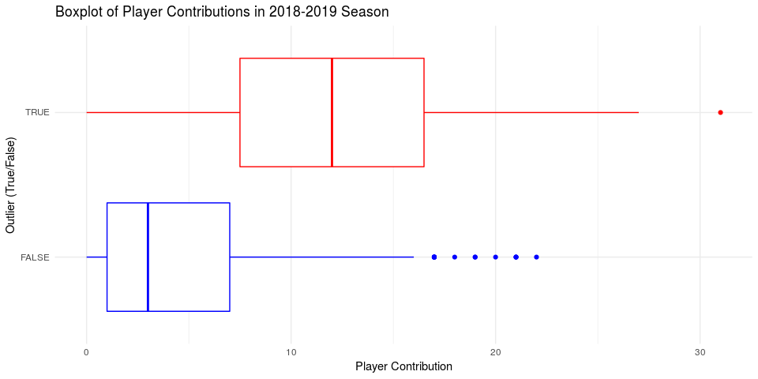

Building the Perfect Soccer Player
================
team-devils
Dec 14, 2018

## Introduction

While soccer’s popularity may be somewhat subdued in the United States,
soccer is not only one of the most widely followed sports in the world,
but also a deeply significant shared cultural experience. According to
the Global World Research Index, 3.2 billion individuals across the
globe watched at least one portion of the 2018 FIFA World Cup. In July
of 2018, Portuguese forward Cristiano Ronaldo transferred from Spanish
club Real Madrid to Italian club Juventus in a €100 million deal. What
combination of factors led to this one soccer player’s multi-million
dollar evaluation? Our team aims to discover what makes the most
valuable soccer player. We will use data of players in the 2018-2019
season of the professional European club soccer league. We selected the
information of players in this league over others due to the fact that
besides the World Cup, the professional European league is the highest
watched and most widely analyzed league in the world. Through
visualizations exploring patterns between markers of success in the
sport of soccer (such as number of assists, number of goals, etc.),
markers of failure (such as number of substitutions off the playing
field, number of own goals, etc.), and market value. In order to answer
our central question, we plan to use linear regression and modeling to
assist us in creating the most valuable soccer player. Our data is a
collection of the top 500 most valuable players in the 2018-2019
European club season (data collected on 11/27/2018). We recognize that
by using the top 500 players by market value (which is in and of itself
a biased measure), we have a sample which is biased and may be right
skewed in terms of market value. We will not be conducting hypothesis
testing due to the former and we will explore possibly analyzing our
data after using a transformation to account for the latter. The data
comes from a professional German soccer statistics website titled
“Transfermarkt”, which is a website dedicated to tracking players’
market values and performances. Transfermarkt.com is a leading medium in
reporting soccer transfer news and they have connections with all of the
major leagues and clubs across Europe, South America, and Asia. The
player statistics are generated after each match and analyzed by
professional scouts, soccer analysts and data scientists. Each
observation is a player, and includes the variables name, position,
number of matches, number of goals scored, number of own goals, number
of assists, number of yellow cards, number of red cards, number of
substitutions on, number of substitutions off, and market value. The
data was obtained from transfermarkt.com through web scraping tools
learned from the course.

## Data Analysis

To get a general sense of the market values of all players in the
2018-2019 season, let’s first create a histogram to visualize their
distribution:

``` r
players1 %>%
  ggplot(mapping = aes(market_value, fill = ..count..)) +
  geom_histogram(binwidth = 5) +
  labs(
    title = "Distribution of Player Market Values in 2018-2019 Season",
    x = "Player Market Values in 2018-2019 Season", 
    y = "Count"
  ) +
  theme_minimal() +
  scale_fill_gradient(low="blue", high="red")
```

<!-- -->

In the histogram above, we can see that the distribution of the players’
market values in the 2018-2019 season is right-skewed, and that the most
commonly occuring market value is around $23 million. In the summary
statistics below, we can see that the mean of the market values is
higher than the most commonly occuring market values due to the right
skewedness of the data:

``` r
players1 %>%
  summarise(mean = mean(market_value), median = median(market_value), sd = sd(market_value), min = min(market_value), max = max(market_value))
```

    ## # A tibble: 1 x 5
    ##    mean median    sd   min   max
    ##   <dbl>  <dbl> <dbl> <dbl> <dbl>
    ## 1  35.3     25  25.2    15   180

The median, however, seems to be affected to a lesser extent by the high
valued outliers. In the boxplot below, the blue colored line represents
the median, and the red line represents the mean:

``` r
players1 %>%
  ggplot(mapping = aes(y = market_value)) +
  geom_boxplot() +
  coord_flip() +
  labs(
    title = "Boxplot of Player Market Values in 2018-2019 Season",
    y = "Player Market Values in 2018-2019 season"
  ) +
  theme_minimal() +
  geom_hline(yintercept = 35.3, color = "red") +
  geom_hline(yintercept = 25, color = "blue")
```

<!-- -->

``` r
# Coloring code found on http://www.sthda.com/english/wiki/ggplot2-colors-how-to-change-colors-automatically-and-manually
```

The boxplot also revaled that there are many outliers in the data. The
table below shows the names and market values of the outlying soccer
players:

``` r
players1 %>%
  select(name, market_value) %>%
  filter(market_value > 75) %>%
  kable()
```

| name                    | market\_value |
| :---------------------- | ------------: |
| Kylian Mbappé           |           180 |
| Neymar                  |           180 |
| Lionel Messi            |           180 |
| Mohamed Salah           |           150 |
| Harry Kane              |           150 |
| Antoine Griezmann       |           150 |
| Kevin De Bruyne         |           150 |
| Philippe Coutinho       |           150 |
| Eden Hazard             |           150 |
| Paulo Dybala            |           110 |
| Dele Alli               |           100 |
| Romelu Lukaku           |           100 |
| Cristiano Ronaldo       |           100 |
| Mauro Icardi            |            95 |
| Marco Asensio           |            90 |
| Sergej Milinkovic-Savic |            90 |
| Leroy Sané              |            90 |
| Saúl Níguez             |            90 |
| Raheem Sterling         |            90 |
| Paul Pogba              |            90 |
| Isco                    |            90 |
| Gareth Bale             |            90 |
| Gabriel Jesus           |            80 |
| Ousmane Dembélé         |            80 |
| N’Golo Kanté            |            80 |
| Raphaël Varane          |            80 |
| Roberto Firmino         |            80 |
| Jan Oblak               |            80 |
| James Rodríguez         |            80 |
| Marc-André ter Stegen   |            80 |
| Christian Eriksen       |            80 |
| Sergio Busquets         |            80 |
| Robert Lewandowski      |            80 |
| Toni Kroos              |            80 |
| Sergio Agüero           |            80 |

These players have extremely high market values compared to the rest of
the players. Which raises the question: do they contribute much more
than the other players? Let a player’s contribution be the sum of the
player’s goals and assists, the following boxplots compare the
contributions of the outlying players to that of the “normal” players:

``` r
players1 <- players1 %>%
  mutate(outlier = ifelse(
    market_value >75, T, F
  ), 
  contribution = goals + assists
  )

players1 %>%
  ggplot(mapping = aes(x = outlier, y = contribution, color = outlier)) +
  scale_color_manual(values = c("blue", "red")) +
  geom_boxplot() +
  labs(
    title = "Boxplot of Player Contributions in 2018-2019 Season",
    x = "Outlier (True/False)", 
    y = "Count"
  ) +
  guides(color = "none") +
  coord_flip() +
  theme_minimal() 
```

<!-- -->

We can see from the comparison above that the outlying soccer players
with very high market values do contribute significantly more, therefore
their high market value is justified.

Now we would like to investigate the relationship between a player’s
position and the number of goals they score. In order to reduce
confusion, we condensed our data of 13 player positions into 4:
Defender, Forward, Goalkeeper, and Midfielder. We found the average
goals made by each position and average assists made by each position:

``` r
position_goals <- players1 %>%
  group_by(position_new) %>%
  summarise(goals_avg = mean(goals), assists_avg = mean(assists))

position_goals
```

    ## # A tibble: 4 x 3
    ##   position_new goals_avg assists_avg
    ##   <chr>            <dbl>       <dbl>
    ## 1 Defender         0.797      1.27  
    ## 2 Forward          5.61       3.19  
    ## 3 Goalkeeper       0          0.0455
    ## 4 Midfielder       2.14       2.01

``` r
position_goals %>%
  mutate(position_new = fct_reorder(position_new, goals_avg)) %>%
  ggplot(mapping = aes(x = position_new, y = goals_avg)) +
  geom_col() +
  labs(
    title = "Average Goals Scored in Each Position in the 2018-2019 Season",
    x = "Position", 
    y = "Average Goals Scored"
  ) +
  coord_flip() +
  theme_minimal()
```

<!-- -->

``` r
position_goals %>%
  mutate(position_new = fct_reorder(position_new, assists_avg)) %>%
  ggplot(mapping = aes(x = position_new, y = assists_avg)) +
  geom_col() +
  labs(
    title = "Average Assists in Each Position in the 2018-2019 Season",
    x = "Position", 
    y = "Average Assists"
  ) +
  coord_flip() +
  theme_minimal()
```

<!-- -->

From the visualizations above, we can see that forward players have the
most goals and assists on average, followed by midfielder, defender and
goalkeeper. This is expected because forward players are the closest to
the goal of the opposing team, making them the most likely to score and
assist goals. Midfielders are the second closest, followed by defenders
and goalkeepers. Interestingly, the average assists for goalkeeper is
greater than 0. Let’s find out which goalkeeper assisted a goal:

``` r
players1 %>%
  select(name, position_new, assists) %>%
  filter(position_new == "Goalkeeper", assists > 0)
```

    ## # A tibble: 1 x 3
    ##   name    position_new assists
    ##   <chr>   <chr>          <int>
    ## 1 Ederson Goalkeeper         1

It looks like Ederson is the only goalkeeper who assisted a goal in the
2018-2019
season.

### What Makes a Valuable Soccer Player?

``` r
linear_prediction  <- lm(market_value ~ position_new + age + matches + goals + own_goals +
                  assists + yellow_cards + red_cards + substituted_on +
                  substituted_off + age_range + position_new * goals + position_new * assists, data =   players1)
tidy(linear_prediction)
```

    ## # A tibble: 21 x 5
    ##    term                   estimate std.error statistic p.value
    ##    <chr>                     <dbl>     <dbl>     <dbl>   <dbl>
    ##  1 (Intercept)              12.6      15.4      0.818  0.414  
    ##  2 position_newForward     -13.5       4.53    -2.99   0.00293
    ##  3 position_newGoalkeeper    4.60      5.76     0.798  0.425  
    ##  4 position_newMidfielder    5.51      3.74     1.48   0.141  
    ##  5 age                       0.112     0.734    0.153  0.879  
    ##  6 matches                   0.579     0.219    2.64   0.00852
    ##  7 goals                     2.04      1.66     1.23   0.220  
    ##  8 own_goals                -0.367     5.66    -0.0649 0.948  
    ##  9 assists                   0.789     1.12     0.707  0.480  
    ## 10 yellow_cards             -0.515     0.599   -0.859  0.391  
    ## # ... with 11 more rows

To begin with, we try to make a multiple linear regression based on all
the statistical variables we have in the players dataset. In soccer,
player’s position is highly correlated with his performances, especially
goals and assists (e.g. Centre-Forwards get most goals and Midfielders
make most assists in general while Goalkeepers can seldom score a goal
or make an assist). Therefore, we managed to introduce two interactions
between position/goals and position/assists into our multiple linear
model.

``` r
tidy(selected_model)
```

    ## # A tibble: 15 x 5
    ##    term                           estimate std.error statistic   p.value
    ##    <chr>                             <dbl>     <dbl>     <dbl>     <dbl>
    ##  1 (Intercept)                      15.9       5.35      2.98  0.00304  
    ##  2 position_newForward             -16.5       3.85     -4.29  0.0000215
    ##  3 position_newGoalkeeper            6.77      5.46      1.24  0.216    
    ##  4 position_newMidfielder            3.71      3.53      1.05  0.293    
    ##  5 matches                           0.406     0.179     2.26  0.0242   
    ##  6 goals                             2.02      1.64      1.23  0.221    
    ##  7 assists                           0.885     1.10      0.802 0.423    
    ##  8 age_range21-25                    3.66      4.49      0.815 0.415    
    ##  9 age_range26-30                    9.07      4.53      2.00  0.0457   
    ## 10 age_range30 and above            -0.922     5.71     -0.162 0.872    
    ## 11 position_newForward:goals         0.937     1.68      0.557 0.578    
    ## 12 position_newMidfielder:goals     -1.45      1.85     -0.783 0.434    
    ## 13 position_newForward:assists       2.74      1.28      2.14  0.0325   
    ## 14 position_newGoalkeeper:assists   23.4      22.1       1.06  0.290    
    ## 15 position_newMidfielder:assists   -0.366     1.52     -0.241 0.809

``` r
glance(linear_prediction)$AIC
```

    ## [1] 4513.152

``` r
glance(selected_model)$AIC
```

    ## [1] 4504.674

Through the model selection based on AIC, we can see that the variables
“age”, “own\_goals”, “yellow\_cards”, “red\_cards”, “substituted\_on”,
substituted\_off" are eliminated. The AIC is reduced compared to the
previous dataset (4513.152 to 4504.674), which can be interpreted as the
increased likelihood of the model.

``` r
glance(selected_model)$r.squared
```

    ## [1] 0.2935472

``` r
test_cv <- crossv_kfold(players1, 10)
models <- map(test_cv$train, ~ selected_model)
rmses <- map2_dbl(models, test_cv$test, rmse)
```

    ## Warning in predict.lm(model, data): prediction from a rank-deficient fit
    ## may be misleading
    
    ## Warning in predict.lm(model, data): prediction from a rank-deficient fit
    ## may be misleading
    
    ## Warning in predict.lm(model, data): prediction from a rank-deficient fit
    ## may be misleading
    
    ## Warning in predict.lm(model, data): prediction from a rank-deficient fit
    ## may be misleading
    
    ## Warning in predict.lm(model, data): prediction from a rank-deficient fit
    ## may be misleading
    
    ## Warning in predict.lm(model, data): prediction from a rank-deficient fit
    ## may be misleading
    
    ## Warning in predict.lm(model, data): prediction from a rank-deficient fit
    ## may be misleading
    
    ## Warning in predict.lm(model, data): prediction from a rank-deficient fit
    ## may be misleading
    
    ## Warning in predict.lm(model, data): prediction from a rank-deficient fit
    ## may be misleading
    
    ## Warning in predict.lm(model, data): prediction from a rank-deficient fit
    ## may be misleading

``` r
rmses
```

    ##        1        2        3        4        5        6        7        8 
    ## 17.10476 14.21914 17.45398 21.12462 22.77454 32.57364 20.42598 20.34975 
    ##        9       10 
    ## 23.98163 16.13049

## Conclusion

Your project goes here\! Before you submit, make sure your chunks are
turned off with `echo = FALSE`.

You can add sections as you see fit. Make sure you have a section called
Introduction at the beginning and a section called Conclusion at the
end. The rest is up to you\!
