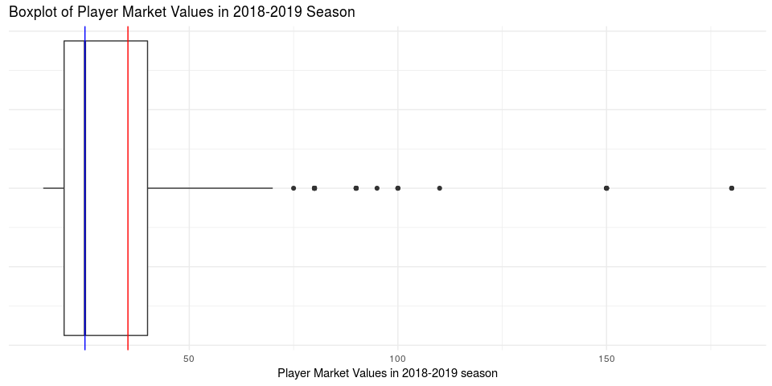

Building the Perfect Soccer Player
================
team-devils
Dec 14, 2018

## Introduction

While its popularity may be somewhat subdued in the United States,
soccer is not only one of the most widely followed sports in the world,
but also a deeply significant shared cultural experience. According to
the Global World Research Index, 3.2 billion individuals across the
globe watched at least one portion of the 2018 FIFA World Cup. In July
of 2018, Portuguese forward Cristiano Ronaldo transferred from Spanish
club Real Madrid to Italian club Juventus in a €100 million deal. What
combination of factors led to this one soccer player’s multi-million
euro evaluation? Our team aims to discover what makes the most valuable
soccer player. Here, the market value of a player is defined as the
monetary amount that a club would pay in order to sign the player from
his original club (also known as transfer). We will use data of players
in the 2018-2019 season of the professional European club soccer leagues
(majorly Premier League, La Liga, Serie A, Bundesliga, and France Ligue
1). We selected the information of players in this league over others
due to the fact that besides the World Cup, the professional European
leagues are the highest watched and most widely analyzed leagues in the
world. Through visualizations exploring patterns between markers of
success in the sport of soccer (such as number of assists, number of
goals, etc.), markers of failure (such as number of yellow cards, number
of red cards, number of own goals, etc.), and market value. In order to
answer our central question, we plan to use linear regression and
modeling to assist us in creating the most valuable soccer player. Our
data is a collection of the top 500 most valuable players in the
2018-2019 European club season (data collected on 11/27/2018). We
recognize that by using the top 500 players by market value (which is in
and of itself a biased measure), we have a sample which is biased and
may be right skewed in terms of market value. We will not be conducting
hypothesis testing due to the former and we will explore possibly
analyzing our data after using a transformation to account for the
latter. The data comes from a professional German soccer statistics
website titled “Transfermarkt”, which is a website dedicated to tracking
players’ market values and performances. Transfermarkt.com is a leading
medium in reporting soccer transfer news and they have connections with
all of the major leagues and clubs across Europe, South America, and
Asia. The player statistics are generated after each match and analyzed
by professional scouts, soccer analysts and data scientists. Each
observation is a player, and includes the variables name, position,
number of matches, number of goals scored, number of own goals, number
of assists, number of yellow cards, number of red cards, number of
substitutions on, number of substitutions off, and market value. To
better fit the model, we cleaned up the data by merging age and position
into four categories. The data was obtained from transfermarkt.com
through web scraping tools learned from the course.

## Data Analysis

To get a general sense of the market values of all players in the
2018-2019 season, let’s first create a histogram to visualize their
distribution:

``` r
players1 %>%
  ggplot(mapping = aes(market_value)) +
  geom_histogram(binwidth = 5) +
  labs(
    title = "Distribution of Player Market Values in 2018-2019 Season",
    x = "Player Market Values in 2018-2019 Season", 
    y = "Count"
  ) +
  theme_minimal()
```


We also performed a log transformation on the market values of players
for comparison:

``` r
players1 %>%
  ggplot(mapping = aes(log(market_value))) +
  geom_histogram(binwidth = 0.1) +
  labs(
    title = "Distribution of the Logarithm of Player Market Values in 2018-2019 Season",
    x = "Player Market Values in 2018-2019 season", 
    y = "Count"
  ) +
  theme_minimal()
```


Since the data we have chosen concerns only the top 500 valuable
players, the dataset is right skewed instead of normally distributed.
After the log transformation, the dataset remains right-skewed and does
not provide any additional insights for the readers. Therefore, we
decided to adhere to the original model and discard the log
transformation.

In the Figure 1, we can see that the distribution of the top 500
players’ market values in the 2018-2019 season is right-skewed, and
that the most commonly occuring market value is around $23 million. In
the summary statistics below, we can see that the mean of the market
values is higher than the most commonly occuring market values due to
the right skewedness of the data:

``` r
players1 %>%
  summarise(mean = mean(market_value), median = median(market_value), sd = sd(market_value), min = min(market_value), max = max(market_value))
```

    ## # A tibble: 1 x 5
    ##    mean median    sd   min   max
    ##   <dbl>  <dbl> <dbl> <dbl> <dbl>
    ## 1  35.3     25  25.2    15   180

The median, however, seems to be affected to a lesser extent by the high
valued outliers. In the boxplot below, the blue colored line represents
the median, and the red line represents the mean:

``` r
players1 %>%
  ggplot(mapping = aes(y = market_value)) +
  geom_boxplot() +
  coord_flip() +
  labs(
    title = "Boxplot of Player Market Values in 2018-2019 Season",
    y = "Player Market Values in 2018-2019 season"
  ) +
  theme_minimal() +
  geom_hline(yintercept = 35.3, color = "red") +
  geom_hline(yintercept = 25, color = "blue") +
  theme(axis.text.y=element_blank()) 
```



The boxplot also revealed that there are many outliers in the data. The
table below shows the names and market values of the outlying soccer
players:

``` r
players1 %>%
  select(name, market_value) %>%
  filter(market_value > 75) %>%
  kable()
```

| name                    | market\_value |
| :---------------------- | ------------: |
| Kylian Mbappé           |           180 |
| Neymar                  |           180 |
| Lionel Messi            |           180 |
| Mohamed Salah           |           150 |
| Harry Kane              |           150 |
| Antoine Griezmann       |           150 |
| Kevin De Bruyne         |           150 |
| Philippe Coutinho       |           150 |
| Eden Hazard             |           150 |
| Paulo Dybala            |           110 |
| Dele Alli               |           100 |
| Romelu Lukaku           |           100 |
| Cristiano Ronaldo       |           100 |
| Mauro Icardi            |            95 |
| Marco Asensio           |            90 |
| Sergej Milinkovic-Savic |            90 |
| Leroy Sané              |            90 |
| Saúl Níguez             |            90 |
| Raheem Sterling         |            90 |
| Paul Pogba              |            90 |
| Isco                    |            90 |
| Gareth Bale             |            90 |
| Gabriel Jesus           |            80 |
| Ousmane Dembélé         |            80 |
| N’Golo Kanté            |            80 |
| Raphaël Varane          |            80 |
| Roberto Firmino         |            80 |
| Jan Oblak               |            80 |
| James Rodríguez         |            80 |
| Marc-André ter Stegen   |            80 |
| Christian Eriksen       |            80 |
| Sergio Busquets         |            80 |
| Robert Lewandowski      |            80 |
| Toni Kroos              |            80 |
| Sergio Agüero           |            80 |

These players have extremely high market values compared to the rest of
the players. Which raises the question: do they contribute much more
than the other players? Let a player’s contribution be the sum of the
player’s goals and assists, the following boxplots compare the
contributions of the outlying players to that of the “normal” players:

``` r
players1 <- players1 %>%
  mutate(outlier = ifelse(
    market_value >75, T, F
  ), 
  contribution = goals + assists
  )

players1 %>%
  ggplot(mapping = aes(x = outlier, y = contribution, color = outlier)) +
  scale_color_manual(values = c("blue", "red")) +
  geom_boxplot() +
  labs(
    title = "Boxplot of Player Contributions in 2018-2019 Season",
    x = "Outlier (True/False)", 
    y = "Count"
  ) +
  guides(color = "none") +
  coord_flip() +
  theme_minimal() 
```


We can see from the comparison above that the outlying soccer players
with very high market values do contribute significantly more, therefore
their high market value is justified.

Now we would like to investigate the relationship between a player’s
position and the number of goals they score. In order to reduce
confusion, we condensed our data of 13 player positions into 4:
Defender, Forward, Goalkeeper, and Midfielder. We found the average
goals made by each position and average assists made by each position:

``` r
position_goals <- players1 %>%
  group_by(position_new) %>%
  summarise(goals_avg = mean(goals), assists_avg = mean(assists))

position_goals
```

    ## # A tibble: 4 x 3
    ##   position_new goals_avg assists_avg
    ##   <chr>            <dbl>       <dbl>
    ## 1 Defender         0.797      1.27  
    ## 2 Forward          5.61       3.19  
    ## 3 Goalkeeper       0          0.0455
    ## 4 Midfielder       2.14       2.01

``` r
position_goals %>%
  mutate(position_new = fct_reorder(position_new, goals_avg)) %>%
  ggplot(mapping = aes(x = position_new, y = goals_avg)) +
  geom_col(fill = "blue") +
  labs(
    title = "Average Goals Scored in Each Position in the 2018-2019 Season",
    x = "Position", 
    y = "Average Goals Scored"
  ) +
  coord_flip() +
  theme_minimal()
```


``` r
position_goals %>%
  mutate(position_new = fct_reorder(position_new, assists_avg)) %>%
  ggplot(mapping = aes(x = position_new, y = assists_avg)) +
  geom_col(fill = "purple") +
  labs(
    title = "Average Assists in Each Position in the 2018-2019 Season",
    x = "Position", 
    y = "Average Assists"
  ) +
  coord_flip() +
  theme_minimal()
```


From the visualizations above, we can see that forward players have the
most goals and assists on average, followed by midfielder, defender and
goalkeeper. This is expected because forward players are the closest to
the goal of the opposing team, making them the most likely to score and
assist goals. Midfielders are the second closest, followed by defenders
and goalkeepers. Interestingly, the average assists for goalkeeper is
greater than 0. Let’s find out which goalkeeper assisted a goal:

``` r
players1 %>%
  select(name, position_new, assists) %>%
  filter(position_new == "Goalkeeper", assists > 0)
```

    ## # A tibble: 1 x 3
    ##   name    position_new assists
    ##   <chr>   <chr>          <int>
    ## 1 Ederson Goalkeeper         1

It looks like Ederson is the only goalkeeper who assisted a goal in the
2018-2019 season.

### What Makes a Valuable Soccer Player?

Below is an interactive scatterplot where we can plot all numerical
variables against each other. The opacity of the data points are reduced
so that we can better visualize overlapping data. We used this app to
get a rough idea of which numerical variables are correlated with one
another.

<!--html_preserve-->

<div class="muted well" style="width: 100% ; height: 500px ; text-align: center; box-sizing: border-box; -moz-box-sizing: border-box; -webkit-box-sizing: border-box;">

Shiny applications not supported in static R Markdown documents

</div>

<!--/html_preserve-->

To answer the question “What makes the a valuable soccer player?”, we
made a multiple linear regression based on all the variables we have in
the players dataset. In soccer, a player’s position is highly correlated
with the number of goals and assists (e.g. forward positions score the
most goals and make the most assists in general, while goalkeepers can
seldom score a goal or make an assist). This is also evident from
figures 5 and 6. From the Shiny app, we also saw that goals and assists
are strongly correlated with a player’s market value. Therefore, we
decided to introduce two interactions between position/goals and
position/assists into our multiple linear
model.

``` r
linear_prediction  <- lm(market_value ~ -1 + factor(position_new) + age + matches + goals + own_goals +
                  assists + yellow_cards + red_cards + substituted_on +
                  substituted_off + factor(age_range) + factor(position_new) * goals + factor(position_new) * assists, data =   players1)
tidy(linear_prediction)
```

    ## # A tibble: 21 x 5
    ##    term                           estimate std.error statistic p.value
    ##    <chr>                             <dbl>     <dbl>     <dbl>   <dbl>
    ##  1 factor(position_new)Defender     12.6      15.4      0.818  0.414  
    ##  2 factor(position_new)Forward      -0.965    15.7     -0.0616 0.951  
    ##  3 factor(position_new)Goalkeeper   17.2      16.1      1.07   0.287  
    ##  4 factor(position_new)Midfielder   18.1      15.4      1.17   0.242  
    ##  5 age                               0.112     0.734    0.153  0.879  
    ##  6 matches                           0.579     0.219    2.64   0.00852
    ##  7 goals                             2.04      1.66     1.23   0.220  
    ##  8 own_goals                        -0.367     5.66    -0.0649 0.948  
    ##  9 assists                           0.789     1.12     0.707  0.480  
    ## 10 yellow_cards                     -0.515     0.599   -0.859  0.391  
    ## # ... with 11 more rows

Next, we performed a backwards model selection based on AIC to identify
the variables that significantly affect the players’ market values.

``` r
tidy(selected_model)
```

    ## # A tibble: 15 x 5
    ##    term                               estimate std.error statistic p.value
    ##    <chr>                                 <dbl>     <dbl>     <dbl>   <dbl>
    ##  1 factor(position_new)Defender         15.9       5.35      2.98  3.04e-3
    ##  2 factor(position_new)Forward          -0.607     5.57     -0.109 9.13e-1
    ##  3 factor(position_new)Goalkeeper       22.7       7.05      3.22  1.36e-3
    ##  4 factor(position_new)Midfielder       19.6       5.43      3.61  3.32e-4
    ##  5 matches                               0.406     0.179     2.26  2.42e-2
    ##  6 goals                                 2.02      1.64      1.23  2.21e-1
    ##  7 assists                               0.885     1.10      0.802 4.23e-1
    ##  8 factor(age_range)21-25                3.66      4.49      0.815 4.15e-1
    ##  9 factor(age_range)26-30                9.07      4.53      2.00  4.57e-2
    ## 10 factor(age_range)30 and above        -0.922     5.71     -0.162 8.72e-1
    ## 11 factor(position_new)Forward:goals     0.937     1.68      0.557 5.78e-1
    ## 12 factor(position_new)Midfielder:go…   -1.45      1.85     -0.783 4.34e-1
    ## 13 factor(position_new)Forward:assis…    2.74      1.28      2.14  3.25e-2
    ## 14 factor(position_new)Goalkeeper:as…   23.4      22.1       1.06  2.90e-1
    ## 15 factor(position_new)Midfielder:as…   -0.366     1.52     -0.241 8.09e-1

After the model selection based on AIC, we can see that the new model
has reduced the significant variables down to 15; variables “age”,
“own\_goals”, “yellow\_cards”, “red\_cards”, “substituted\_on”, and
“substituted\_off” have been eliminated.

``` r
tibble(original_model = glance(linear_prediction)$AIC, 
       new_model = glance(selected_model)$AIC
) %>%
  kable()
```

| original\_model | new\_model |
| --------------: | ---------: |
|        4513.152 |   4504.674 |

The AIC value is lower compared to the full model (4513.1522965 to
4504.6741455), which means that the new model contains the variables
that are the most likely to affect the market values. Taking a look at
the adjusted R-squared values before and after backwards selection, our
new model has a slightly higher adjusted R-squared value(0.7530486 to
0.7543797):

``` r
tibble(
  adj_r_squared_before = glance(linear_prediction)$adj.r.squared,
  adj_r_squared_after = glance(selected_model)$adj.r.squared
) %>%
  kable()
```

| adj\_r\_squared\_before | adj\_r\_squared\_after |
| ----------------------: | ---------------------: |
|               0.7530486 |              0.7543797 |

In order to validate our model, we decide to examine the RMSE values
after performing a 10-fold test:

``` r
rmse_tibble
```

    ## # A tibble: 10 x 2
    ##    names     x
    ##    <chr> <dbl>
    ##  1 1      17.4
    ##  2 2      21.8
    ##  3 3      20.2
    ##  4 4      23.3
    ##  5 5      23.6
    ##  6 6      22.8
    ##  7 7      15.5
    ##  8 8      18.0
    ##  9 9      25.3
    ## 10 10     22.1

Histogram and summary statistics of RMSE:

``` r
rmse_tibble %>%
  ggplot(mapping = aes(x)) +
  geom_histogram(binwidth = 1.7) +
  coord_cartesian(xlim = c(0, 190)) +
  labs(
    title = "Distribution of RMSE Values of Linear Model Predicting Market Values",
    x = "RMSE Value", 
    y = "Count"
  ) +
  theme_minimal()
```


``` r
rmse_tibble %>%
  summarise(min = min(x), max = max(x), mean = mean(x), median = median(x), sd = sd(x))
```

    ## # A tibble: 1 x 5
    ##     min   max  mean median    sd
    ##   <dbl> <dbl> <dbl>  <dbl> <dbl>
    ## 1  15.5  25.3  21.0   21.9  3.12

As we can see from the histogram and the summary statistics, the RMSE
values are fairly low compared to the range of our original data, and
they have a low standard deviation. This means that our model is fairly
good.

## Conclusion

According to the selected model, we can build a formula representing the
market value prediction:

`market_value` = 15.9 - 0.607 \* `position_newForward` + 22.7 \*
`position_newGoalkeeper` + 19.6 \* `position_newMidfielder` + 0.406 \*
`matches` + 2.02 \* `goals` + 0.885 \* `assists` + 3.66 \*
`age_range21-25` + 9.07 \* `age_range26-30` - 0.922 `age_range30 and
above` + 0.937 \* `position_newForward:goals` - 1.45 \*
`position_newMidfielder:goals` + 2.74 \* `position_newForward:assists` +
23.4 \* `position_newGoalkeeper:assists` - 0.366 \*
`position_newMidfielder:assists`

Note that in this equation, non numerical variables like `position_new`
and `age_range` will take Boolean values 0 and 1.

Now let’s take a closer look at the model if we plug in different
positions:

For Defenders : market\_value = 15.9 + 0.406 \* matches + 2.02 \* goals
+ 0.885 \* assists + 3.66 \* age\_range21-25 + 9.07 \* age\_range26-30 -
0.922 age\_range30 and above Defenders’ market values will increase if
making more appearances and getting more goals and assists (though
assists and goals are relatively unusual stuff for defenders). Also,
26-30 is the golden age range for a defender.

For Goalkeepers : market\_value = 38.6 + 0.406 \* matches + 2.02 \*
goals + 24.285 \* assists + 3.66 \* age\_range21-25 + 9.07 \*
age\_range26-30 - 0.922 age\_range30 and above Goalkeepers’ market
values will increase if making more appearances, aging between 26 and
30, and getting more goals and assists (Goalies\! Try to run into
opponent’s box to make an assist even if it’s NOT your zone).

For Midfielders : market\_value = 35.5 + 0.406 \* matches + 0.57 \*
goals + 0.519 \* assists + 3.66 \* age\_range21-25 + 9.07 \*
age\_range26-30 - 0.922 age\_range30 and above Midfielders’ market
values will increase if making more appearances, aging between 26 and
30, and getting more goals and assists. The coefficients of goals and
assists for midfielders are lower than those of defenders because being
high in these statistics actually compensate for that.

For Forwards : market\_value = 15.293 + 0.406 \* matches + 2.957 \*
goals + 3.625 \* assists + 3.66 \* age\_range21-25 + 9.07 \*
age\_range26-30 - 0.922 age\_range30 and above Forwards’ market values
will increase if making more appearances and getting more goals and
assists. The starting intercept of forwards is negative. Still, the
golden age of a forward is between 26 and 30. However, the Mr. Most
Expensive, Kylian Mbappe (Forward), is only 19. What a bright young
man\!
