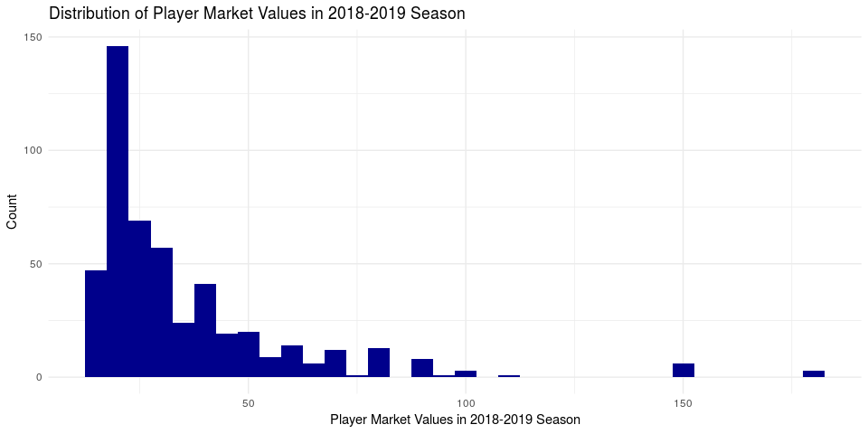

Building the Perfect Soccer Player
================
team-devils
Dec 14, 2018

## Introduction

## Data Analysis

To get a general sense of the market values of all players in the
2018-2019 season, let’s first create a histogram to visualize their
distribution.

``` r
players1 %>%
  ggplot(mapping = aes(market_value, fill = ..count..)) +
  geom_histogram(binwidth = 5) +
  labs(
    title = "Distribution of Player Market Values in 2018-2019 Season",
    x = "Player Market Values in 2018-2019 season", 
    y = "Count"
  ) +
  theme_minimal() +
  scale_fill_gradient(low="blue", high="red")
```

<!-- -->

In the histogram above, we can see that the distribution of the players’
market values in the 2018-2019 season is right skewed, and that the most
commonly occuring market values are slightly less than $25 million. In
the summary statistics below, we can see that the mean of the market
values is higher than the most commonly occuring market values due to
the right skewedness of the data.

``` r
players1 %>%
  summarise(mean = mean(market_value), median = median(market_value), sd = sd(market_value), min = min(market_value), max = max(market_value))
```

    ## # A tibble: 1 x 5
    ##    mean median    sd   min   max
    ##   <dbl>  <dbl> <dbl> <dbl> <dbl>
    ## 1  35.3     25  25.2    15   180

``` r
linear_prediction  <- lm(market_value ~ position + age + matches + goals + own_goals +
                  assists + yellow_cards + red_cards + substituted_on +
                  substituted_off + age_range + position * goals + position * assists, data =   players1)
tidy(linear_prediction)
```

    ## # A tibble: 46 x 5
    ##    term                       estimate std.error statistic p.value
    ##    <chr>                         <dbl>     <dbl>     <dbl>   <dbl>
    ##  1 (Intercept)                   18.1      16.6      1.09  0.274  
    ##  2 positionCentral Midfield      -8.09      6.70    -1.21  0.228  
    ##  3 positionCentre-Back          -10.8       6.54    -1.66  0.0986 
    ##  4 positionCentre-Forward       -23.1       7.59    -3.04  0.00252
    ##  5 positionDefensive Midfield    -5.12      7.48    -0.685 0.494  
    ##  6 positionGoalkeeper            -8.49      7.99    -1.06  0.288  
    ##  7 positionLeft Midfield        -22.4      22.5     -0.999 0.318  
    ##  8 positionLeft Winger          -21.4       7.51    -2.84  0.00464
    ##  9 positionLeft-Back            -18.2       8.93    -2.03  0.0427 
    ## 10 positionRight Midfield        11.8      22.3      0.528 0.598  
    ## # ... with 36 more rows

``` r
tidy(selected_model)
```

    ## # A tibble: 30 x 5
    ##    term                       estimate std.error statistic  p.value
    ##    <chr>                         <dbl>     <dbl>     <dbl>    <dbl>
    ##  1 (Intercept)                   23.4       6.78     3.45  0.000614
    ##  2 positionCentral Midfield     -11.3       6.08    -1.85  0.0646  
    ##  3 positionCentre-Back          -10.1       5.80    -1.73  0.0834  
    ##  4 positionCentre-Forward       -23.8       6.99    -3.41  0.000714
    ##  5 positionDefensive Midfield    -7.17      6.85    -1.05  0.296   
    ##  6 positionGoalkeeper            -4.90      7.07    -0.693 0.489   
    ##  7 positionLeft Midfield        -23.0      22.2     -1.04  0.301   
    ##  8 positionLeft Winger          -20.9       6.75    -3.10  0.00205 
    ##  9 positionLeft-Back            -15.3       7.61    -2.02  0.0444  
    ## 10 positionRight Midfield        12.2      22.1      0.554 0.580   
    ## # ... with 20 more rows

``` r
glance(linear_prediction)$AIC
```

    ## [1] 4534.834

``` r
glance(selected_model)$AIC
```

    ## [1] 4516.383

``` r
glance(selected_model)$r.squared
```

    ## [1] 0.3189235

``` r
test_cv <- crossv_kfold(players1, 10)
models <- map(test_cv$train, ~ selected_model)
rmses <- map2_dbl(models, test_cv$test, rmse)
```

    ## Warning in predict.lm(model, data): prediction from a rank-deficient fit
    ## may be misleading
    
    ## Warning in predict.lm(model, data): prediction from a rank-deficient fit
    ## may be misleading
    
    ## Warning in predict.lm(model, data): prediction from a rank-deficient fit
    ## may be misleading
    
    ## Warning in predict.lm(model, data): prediction from a rank-deficient fit
    ## may be misleading
    
    ## Warning in predict.lm(model, data): prediction from a rank-deficient fit
    ## may be misleading
    
    ## Warning in predict.lm(model, data): prediction from a rank-deficient fit
    ## may be misleading
    
    ## Warning in predict.lm(model, data): prediction from a rank-deficient fit
    ## may be misleading
    
    ## Warning in predict.lm(model, data): prediction from a rank-deficient fit
    ## may be misleading
    
    ## Warning in predict.lm(model, data): prediction from a rank-deficient fit
    ## may be misleading
    
    ## Warning in predict.lm(model, data): prediction from a rank-deficient fit
    ## may be misleading

``` r
rmses
```

    ##        1        2        3        4        5        6        7        8 
    ## 26.18651 23.34984 24.25948 19.48686 22.86035 18.58501 20.11429 20.31887 
    ##        9       10 
    ## 15.63595 14.19599

## Conclusion

Your project goes here\! Before you submit, make sure your chunks are
turned off with `echo = FALSE`.

You can add sections as you see fit. Make sure you have a section called
Introduction at the beginning and a section called Conclusion at the
end. The rest is up to you\!
