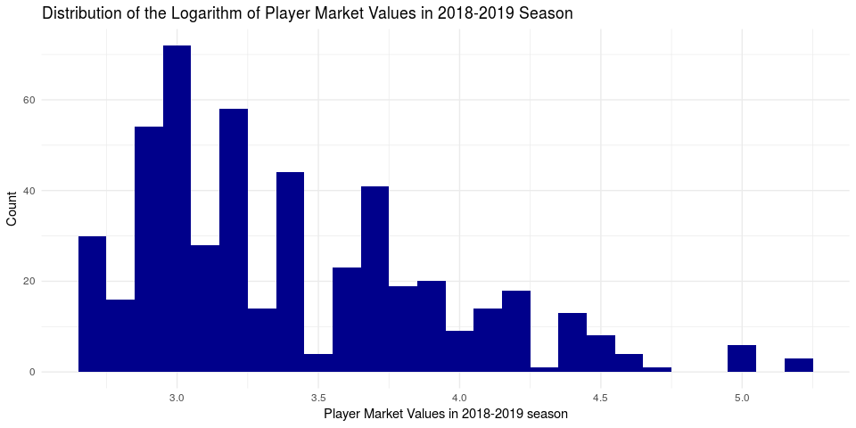

Building the Perfect Soccer Player
================
team-devils
Dec 14, 2018

## Introduction

While its popularity may be somewhat subdued in the United States,
soccer is not only one of the most widely followed sports in the world,
but also a deeply significant shared cultural experience. According to
the Global World Research Index, 3.2 billion individuals across the
globe watched at least one portion of the 2018 FIFA World Cup. In July
of 2018, Portuguese forward Cristiano Ronaldo transferred from Spanish
club Real Madrid to Italian club Juventus in a €100 million deal. What
combination of factors led to this one soccer player’s multi-million
euro evaluation? Our team aims to discover what makes the most valuable
soccer player. Here, the market value of a player is defined as the
monetary amount that a club would pay in order to “purchase”, or sign
the player from his original club to the new club. This is also known as
transfer value. We will use data of players in the 2018-2019 season of
the professional European club soccer leagues. A soccer league is a
national conference that consists of around 20 professional teams. These
are different from national teams, because players on each team come
from various countries. In Europe, the major leagues are the Premier
League (England), La Liga (Spain), Serie A (Italy), Bundesliga
(Germany), and France Ligue 1 (France). We selected the information of
players from all European club soccer leagues over others in the world
due to the fact that besides the World Cup, the professional European
leagues are the highest watched and most widely analyzed leagues in the
world. Through visualizations exploring patterns between markers of
success in the sport of soccer (such as number of assists, number of
goals, etc.), markers of failure (such as number of yellow cards, number
of red cards, number of own goals, etc.), and market value. In order to
answer our central question, we plan to use linear regression and
modeling to assist us in creating the most valuable soccer player. Our
data is a collection of the top 500 most valuable players in the
2018-2019 European club season (data collected on 11/27/2018). We
recognize that by using the top 500 players by market value (which is in
and of itself a biased measure), we have a sample which is biased and
may be right skewed in terms of market value. We will not be conducting
hypothesis testing due to the former and we will explore possibly
analyzing our data after using a transformation to account for the
latter. The data comes from a professional German soccer statistics
website titled “Transfermarkt”, which is a website dedicated to tracking
players’ market values and performances. Transfermarkt.com is a leading
medium in reporting soccer transfer news and they have connections with
all of the major leagues and clubs across Europe, South America, and
Asia. The player statistics are generated after each match and analyzed
by professional scouts, soccer analysts and data scientists. Each
observation is a player, and includes the variables name, position,
number of matches, number of goals scored, number of own goals, number
of assists, number of yellow cards, number of red cards, number of
substitutions on, number of substitutions off, and market value. To
better fit the model, we cleaned up the data by merging age and position
into four categories. The data was obtained from transfermarkt.com
through web scraping tools learned from the course.

## Data Analysis

To get a general sense of the market values of all players in the
2018-2019 season, let’s first create a histogram to visualize their
distribution:

We also performed a log transformation on the market values of players
for comparison:

Since the data we have chosen concerns only the top 500 valuable
players, the dataset is right skewed instead of normally distributed.
After the log transformation, the dataset remains right-skewed and does
not provide any additional insights for the readers. Therefore, we
decided to adhere to the original model and discard the log
transformation.

In the Figure 1, we can see that the distribution of the top 500
players’ market values in the 2018-2019 season is right-skewed, and
that the most commonly occuring market value is around €23 million. In
the summary statistics below, we can see that the mean of the market
values is higher than the most commonly occuring market values due to
the right skewedness of the data:

    ## # A tibble: 1 x 5
    ##    mean median    sd   min   max
    ##   <dbl>  <dbl> <dbl> <dbl> <dbl>
    ## 1  35.3     25  25.2    15   180

The median, however, seems to be affected to a lesser extent by the high
valued outliers. In the boxplot below, the blue colored line represents
the median, and the red line represents the mean:

The boxplot also revealed that there are many outliers in the data. The
table below shows the names and market values of the outlying soccer
players:

| name                    | market\_value |
| :---------------------- | ------------: |
| Kylian Mbappé           |           180 |
| Neymar                  |           180 |
| Lionel Messi            |           180 |
| Mohamed Salah           |           150 |
| Harry Kane              |           150 |
| Antoine Griezmann       |           150 |
| Kevin De Bruyne         |           150 |
| Philippe Coutinho       |           150 |
| Eden Hazard             |           150 |
| Paulo Dybala            |           110 |
| Dele Alli               |           100 |
| Romelu Lukaku           |           100 |
| Cristiano Ronaldo       |           100 |
| Mauro Icardi            |            95 |
| Marco Asensio           |            90 |
| Sergej Milinkovic-Savic |            90 |
| Leroy Sané              |            90 |
| Saúl Níguez             |            90 |
| Raheem Sterling         |            90 |
| Paul Pogba              |            90 |
| Isco                    |            90 |
| Gareth Bale             |            90 |
| Gabriel Jesus           |            80 |
| Ousmane Dembélé         |            80 |
| N’Golo Kanté            |            80 |
| Raphaël Varane          |            80 |
| Roberto Firmino         |            80 |
| Jan Oblak               |            80 |
| James Rodríguez         |            80 |
| Marc-André ter Stegen   |            80 |
| Christian Eriksen       |            80 |
| Sergio Busquets         |            80 |
| Robert Lewandowski      |            80 |
| Toni Kroos              |            80 |
| Sergio Agüero           |            80 |

These players have extremely high market values compared to the rest of
the players. Which raises the question: do they contribute much more
than the other players? Let a player’s contribution be the sum of the
player’s goals and assists, the following boxplots compare the
contributions of the outlying players to that of the “normal” players:

We can see from the comparison above that the outlying soccer players
with very high market values do contribute significantly more, therefore
their high market value is justified.

Now we would like to investigate the relationship between a player’s
position and the number of goals they score. In order to reduce
confusion, we condensed our data of 13 player positions into 4:
Defender, Forward, Goalkeeper, and Midfielder. We found the average
goals made by each position and average assists made by each position:

    ## # A tibble: 4 x 3
    ##   position_new goals_avg assists_avg
    ##   <chr>            <dbl>       <dbl>
    ## 1 Defender         0.797      1.27  
    ## 2 Forward          5.61       3.19  
    ## 3 Goalkeeper       0          0.0455
    ## 4 Midfielder       2.14       2.01

From the visualizations above, we can see that forward players have the
most goals and assists on average, followed by midfielder, defender and
goalkeeper. This is expected because forward players are the closest to
the goal of the opposing team, making them the most likely to score and
assist goals. Midfielders are the second closest, followed by defenders
and goalkeepers. Interestingly, the average assists for goalkeeper is
greater than 0. Let’s find out which goalkeeper assisted a goal:

    ## # A tibble: 1 x 3
    ##   name    position_new assists
    ##   <chr>   <chr>          <int>
    ## 1 Ederson Goalkeeper         1

It looks like Ederson is the only goalkeeper who assisted a goal in the
2018-2019 season.

### What Makes a Valuable Soccer Player?

Below is an interactive scatterplot where we can plot all numerical
variables against each other. The opacity of the data points are reduced
so that we can better visualize overlapping data. We used this app to
get a rough idea of which numerical variables are correlated with one
another.

<!--html_preserve-->

Shiny applications not supported in static R Markdown documents

<!--/html_preserve-->

To answer the question “What makes the a valuable soccer player?”, we
made a multiple linear regression based on all the variables we have in
the players dataset. In soccer, a player’s position is highly correlated
with the number of goals and assists (e.g. forward positions score the
most goals and make the most assists in general, while goalkeepers can
seldom score a goal or make an assist). This is also evident from
figures 5 and 6. From the Shiny app, we also saw that goals and assists
are strongly correlated with a player’s market value. Therefore, we
decided to introduce two interactions between position/goals and
position/assists into our multiple linear model.

    ## # A tibble: 21 x 5
    ##    term                           estimate std.error statistic p.value
    ##    <chr>                             <dbl>     <dbl>     <dbl>   <dbl>
    ##  1 factor(position_new)Defender     12.6      15.4      0.818  0.414  
    ##  2 factor(position_new)Forward      -0.965    15.7     -0.0616 0.951  
    ##  3 factor(position_new)Goalkeeper   17.2      16.1      1.07   0.287  
    ##  4 factor(position_new)Midfielder   18.1      15.4      1.17   0.242  
    ##  5 age                               0.112     0.734    0.153  0.879  
    ##  6 matches                           0.579     0.219    2.64   0.00852
    ##  7 goals                             2.04      1.66     1.23   0.220  
    ##  8 own_goals                        -0.367     5.66    -0.0649 0.948  
    ##  9 assists                           0.789     1.12     0.707  0.480  
    ## 10 yellow_cards                     -0.515     0.599   -0.859  0.391  
    ## # ... with 11 more rows

Next, we performed a backwards model selection based on AIC to identify
the variables that significantly affect the players’ market values.

    ## # A tibble: 15 x 5
    ##    term                               estimate std.error statistic p.value
    ##    <chr>                                 <dbl>     <dbl>     <dbl>   <dbl>
    ##  1 factor(position_new)Defender         15.9       5.35      2.98  3.04e-3
    ##  2 factor(position_new)Forward          -0.607     5.57     -0.109 9.13e-1
    ##  3 factor(position_new)Goalkeeper       22.7       7.05      3.22  1.36e-3
    ##  4 factor(position_new)Midfielder       19.6       5.43      3.61  3.32e-4
    ##  5 matches                               0.406     0.179     2.26  2.42e-2
    ##  6 goals                                 2.02      1.64      1.23  2.21e-1
    ##  7 assists                               0.885     1.10      0.802 4.23e-1
    ##  8 factor(age_range)21-25                3.66      4.49      0.815 4.15e-1
    ##  9 factor(age_range)26-30                9.07      4.53      2.00  4.57e-2
    ## 10 factor(age_range)30 and above        -0.922     5.71     -0.162 8.72e-1
    ## 11 factor(position_new)Forward:goals     0.937     1.68      0.557 5.78e-1
    ## 12 factor(position_new)Midfielder:go…   -1.45      1.85     -0.783 4.34e-1
    ## 13 factor(position_new)Forward:assis…    2.74      1.28      2.14  3.25e-2
    ## 14 factor(position_new)Goalkeeper:as…   23.4      22.1       1.06  2.90e-1
    ## 15 factor(position_new)Midfielder:as…   -0.366     1.52     -0.241 8.09e-1

From the selected model, we can observe that the player’s position
decides the value of y-intercept. If the player is a Defender, its
prediction formula constant would be 15.9 million euro, and -0.607
million euro for Forward, 22.7 million euro for Goalkeeper, and 19.6
million euro for Midfielder. Next, if a player appears on field in one
more match, his market value would in general increase by 0.406 million
euro; if a player scores a goal, his market value would in general
increase by 2.02 million euro; if a player makes an assist, his market
value would in average increase by 0.885 million euro. Compared to
players below 20 years old, players aged between 21 and 25 are averagely
3.66 million euro more valuable, players aged between 26 and 30 are
averagely 9.07 million euro more valuable, and players above 30-year-old
are generally 0.366 million euro less valuable. Additionally, we have
taken the interactions between position/goals and position/assists into
account. In average, every goal can get a forward 0.937 million euro
increase in market value, while every goal can get a midfilder 1.45
million euro decrease in market value. Every assist can get a forward
2.74 million euro increase in market value; Every assist can get a
goalkeeper 23.4 million euro increase in market value; However, every
assist can get a midfielder 0.366 million euro decrease in market value.

After the model selection based on AIC, we can see that the new model
has reduced the significant variables down to 15; variables “age”,
“own\_goals”, “yellow\_cards”, “red\_cards”, “substituted\_on”, and
“substituted\_off” have been eliminated.

| original\_model | new\_model |
| --------------: | ---------: |
|        4513.152 |   4504.674 |

The AIC value is lower compared to the full model (4513.1522965 to
4504.6741455), which means that the new model contains the variables
that are the most likely to affect the market values. Taking a look at
the adjusted R-squared values before and after backwards selection, our
new model has a slightly higher adjusted R-squared value(0.7530486 to
0.7543797):

| adj\_r\_squared\_before | adj\_r\_squared\_after |
| ----------------------: | ---------------------: |
|               0.7530486 |              0.7543797 |

In order to validate our model, we decide to examine the RMSE values
after performing a 10-fold test:

    ## # A tibble: 10 x 2
    ##    names     x
    ##    <chr> <dbl>
    ##  1 1      17.4
    ##  2 2      21.8
    ##  3 3      20.2
    ##  4 4      23.3
    ##  5 5      23.6
    ##  6 6      22.8
    ##  7 7      15.5
    ##  8 8      18.0
    ##  9 9      25.3
    ## 10 10     22.1

Histogram and summary statistics of RMSE:

    ## # A tibble: 1 x 5
    ##     min   max  mean median    sd
    ##   <dbl> <dbl> <dbl>  <dbl> <dbl>
    ## 1  15.5  25.3  21.0   21.9  3.12

As we can see from the histogram and the summary statistics, the RMSE
values are fairly low compared to the range of our original data, and
they have a low standard deviation. This means that our model is fairly
good.

According to the selected model, we can build a formula representing the
market value prediction:

`market_value` = 15.9 - 0.607 \* `position_newForward` + 22.7 \*
`position_newGoalkeeper` + 19.6 \* `position_newMidfielder` + 0.406 \*
`matches` + 2.02 \* `goals` + 0.885 \* `assists` + 3.66 \*
`age_range21-25` + 9.07 \* `age_range26-30` - 0.922 \* `age_range30 and
above` + 0.937 \* `position_newForward:goals` - 1.45 \*
`position_newMidfielder:goals` + 2.74 \* `position_newForward:assists` +
23.4 \* `position_newGoalkeeper:assists` - 0.366 \*
`position_newMidfielder:assists`

Note that in this equation, non numerical variables like `position_new`
and `age_range` will take Boolean values 0 and 1.

### What does our model tell us?

From the selected model, we can observe that the player’s position
determines the value of the y-intercept. On average, if the player is a
defender, he would begin with 15.9 million euro; if the player is a
forward, he would begin with -0.607 million euro; if the player is a
goalkeeper, he would begin with 22.7 million euro; and lastly, if the
player is a midfielder, his prediction formula constant would be 19.6
million. We found that for every additional match a player appears at,
his market value would increases by 0.406 million euro on average; for
every additional goal scored, his market value would increase by 2.02
million euro on average; and for every additional goal assisted, his
market value would increase by 0.885 million euro on average. Players
aged between 21 to 25 will on average have 3.66 million euro added to
their baseline market value. Players aged between 26 and 30 are on
average worth 9.07 million euro above the baseline; and players above
30-year-old are on average worth 0.366 million euro less than their
baseline market value.

Additionally, we have taken the interactions between position/goals and
position/assists into account. On average, every goal scored can
increase a forward’s market value by 0.937 million euro on average,
while every goal can decrease a midfilder’s market value by 1.45 million
euro on average. Every assist can increase a forward’s market value by
2.74 million euro on average; every assist can increase a midfielder’s
market value by 0.366 million euro on average. Lastly, if a goalkeeper
makes an assist, he is expected to get a 23.4 million euro increase in
market value on average.

## Conclusion

### What We Did

Our research question of what makes the most valuable soccer player
first led us to conduct exploratory data visualization. By first
plotting the distribution of our data, we found the spread of market
value to be quite right-skewed. The right skew is due to the fact that
we only scraped the 500 most valuable players from the European club
soccer league. For comparison, we plotted the logarithmic distribution
of the market values to see if the distribution would be more normal.
The spread was still quite right-skewed so we decided to use our
regular, non-transformed distribution for exploratory data analysis and
modeling.

After plotting a boxplot of the data, we found several outliers in
market value and decided to identify the players whose market values
were significantly higher than the rest of the players. We compared
their median contribution (defined as sum of number of goals and number
of assists) to that of the non-outlying players in the season thus far,
and found their contribution to be greater. This result somewhat
justifies their higher market values.

We then explored performance by position, and found that forwards score
the most goals and perform the most assists, followed by midfielders,
then defenders, and then goalkeepers.

Furthermore, we created a Shiny app that allowed us to explore trends in
our dataset by selecting the x-axis, y-axis, and color to be different
variables. The app helped us quickly identify some patterns in the
dataset to keep in mind while we perform our analyses.

After exploring the data and the relationships between the variables
through summary statistics and visualizations, we created a full linear
model and used backwards selection to craft a model that predicts market
values based on selected variables in our dataset. The new model has an
adjusted R squared value of 0.7543797, which is quite high and shows
that the model is a good fit. Furthermore, a cross validation test
produced RMSE values that are quite low, with a low standard deviation,
showing that the model provides consistently accurate predictions across
the entire dataset.

### What We Found

In general, 26-30 is the optimal age range for any soccer player. With
each match, goal, and assist, a player’s market value is expected to
increase. That being said, the interactions between market value/goals
and market value/assists complicate the model slightly. Their effects
are described below:

For Defenders: The estimated baseline market value for a defender is
15.9 million euro. Defenders’ market values will increase for each
match, goal, and assist (though assists and goals are relatively unusual
for defenders).

For Goalkeepers: The estimated baseline market value for a goalkeeper is
22.7 million euro. Goalkeepers’ market values will increase for every
match. Although we can observe a very high coefficient for assists, we
are not taking it into account because only one goalkeeper in the
dataset made an assist. Goalkeepers are, if anything, discouraged from
rushing into the opponent’s box to score a goal or make an assist.

For Midfielders: The estimated baseline market value for a midfielder is
19.6 million euro. Midfielders’ market values will increase for every
match, goal, and assist. They have lower coefficients for goals and
assists compared to defenders because they are expected to score more
goals and make more assists.

For Forwards: The estimated baseline market value for a forward is
-0.607 million euro. Forwards’ market values will increase for every
match, goal, and assist.

### How We Can Improve

While we attempted to use the statistical methods from the course to the
best of our abilities, there are several areas we could improve upon. We
did not do the thorough research required to fully understand the source
of the market value prices we obtained from the Transfer Markt website.
Therefore, the market value prices may be inaccurate, resulting in
skewed findings. Furthermore, we could have investigated the data
collection methodologies used by Transfer Markt more thoroughly in order
to verify the validity of all other player variables. Cross-referencing
the information in the data set with individual leagues’ internal
records would be one of the ways to resolve this issue. Lastly, our data
only contained values from the first half of the 2018-2019 season, but
the market value of a player can hardly be determined by a single
season. Therefore, introducing data from previous seasons might help us
create a better model.

If we were to redo our project, we would increase the sample size and
include all players in the league instead of choosing the top 500 most
valuable players, and analyze an entire season’s player performance
statistics instead of only half of a season. Such an approach would
alleviate the right skewedness of the data and provide more conclusive
results. Additionally, we would no longer condense the players’
positions into four main positions: forward, backward, center, and
goalkeeper, but instead keep the more precise positions. The more
specific player positions would yield more precise models. Lastly, we
would like to explore how market values have changed over time,
introducing soccer players’ market values and stats from 1990-1991,
2000-2001, 2010-2011, and 2018-2019 seasons.
