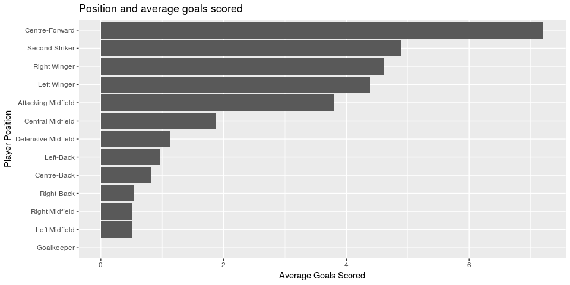
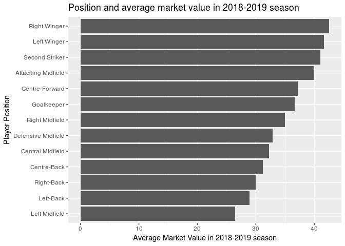

Building the Perfect Soccer Player
================
Team Devils
11/28/2018

## Section 1. Introduction

What makes the most valuable soccer player? We wish to explore how
performance during a season, physical attributes, and general
characteristics of soccer players such as age and position affect their
market value during a season. Through exploratory visualizations and
modeling, we hope to explore whether or not and how each characteristic
is correlated to performance and market value for a player, and whether
patterns exist between markers of success (such as number of assists,
number of goals, etc.) and failure (number of substitions off the
playing field, number of own goals, etc.) and value during a season. We
plan to first use visualizations to discover patterns, and then modeling
to develop our central question of which characteristics of players
impact value as viewed by the soccer market. In order to answer our
question, we plan to construct a model which predicts the relative
market value of any player in the European club league during the
2018-2019 season. We plan to delve deep into the construction of this
model, and find a creative way to communicate and display it
effectively. The shiny package may be a tool we use down the line if our
project evolves.

Our data is a collection of the top 500 most valuable players in the
2018-2019 European club season (data collected on 11/27/2018). We
recognize that by using the top 500 players by market value (which is in
and of itself a biased measure), we have a sample which is biased and
may be right skewed in terms of market value. We will not be conducting
hypthosis testing due to the former and we will explore possibly
analyzing our data after using a transformation to account for the
latter. The data comes from a professional German soccer statistics
website titled “Transfermarkt”, which is a website dedicated to tracking
players’ market values and performances. Transfermarkt.com is a leading
medium in reporting soccer transfer news and they have connections with
all of the major leagues and clubs across Europe, South America, and
Asia. The player statistics are generated after each match and analyzed
by professional scouts, soccer analysts and data scientists. Each
observation is a player, and includes the variables name, position,
number of matches, number of goals scored, number of own goals, number
of assists, number of yellow cards, number of red cards, number of
substitutions on, number of substitutions off, and market value. The
data was obtained from transfermarkt.com through web scraping tools
learned from the course, and the script used to scrape the data
`(web_scrape.R)` can be found in this repository. This file also has the
url used to scrape. A citation in order to account for the url’s dynamic
state is also included in the READme markdown of the data folder.

## Section 2. Data analysis plan

## Variables

Here we use 11 variables as predictors (position, age, matches, goals,
own\_goals, assists, yellow\_cards, red\_cards, substituted\_on,
substituted\_off). These variables are used to predict the final outcome
variable —- market\_value. The meanings of all variables are explained
in the codebook in README.

## Statistical Methods

Since this is not a random sample, we will not do hypotheses testing.
Instead, we would like to come to a prediction rule on players’ market
value based on given variables. First since the variables that show
significant correlation, we will calculate a preliminary confidence
interval of the players’ general performances based on statistics using
bootstrapping. Then, we will make a model for `market_value`, using all
of the explanatory variables and the possible interactions between them
(e.g. the interaction between `position` and `goals` because common
knowledge tells us that there will be a correlation between the two). If
we can obtain the proper data for comparison, we also plan to compare
our model of player’s market value with historical data so that we can
obtain the trend of transfer markets. We will test the final model on
partitions of our data to evaluate it, and in the end attempt to come up
with a generalization about the conditions that will produce the highest
market value.

    ## Parsed with column specification:
    ## cols(
    ##   name = col_character(),
    ##   position = col_character(),
    ##   age = col_integer(),
    ##   matches = col_integer(),
    ##   goals = col_integer(),
    ##   own_goals = col_integer(),
    ##   assists = col_integer(),
    ##   yellow_cards = col_integer(),
    ##   red_cards = col_integer(),
    ##   substituted_on = col_integer(),
    ##   substituted_off = col_integer(),
    ##   market_value = col_double(),
    ##   position_new = col_character()
    ## )

### Summary Statistics

We can see that the most common position among the top 500 players is
Central Midfield. The least common positions are Left Midfield and Right
Midfield.

    ## # A tibble: 13 x 2
    ##    position               n
    ##    <chr>              <int>
    ##  1 Attacking Midfield    40
    ##  2 Central Midfield      82
    ##  3 Centre-Back           82
    ##  4 Centre-Forward        71
    ##  5 Defensive Midfield    38
    ##  6 Goalkeeper            22
    ##  7 Left Midfield          2
    ##  8 Left Winger           49
    ##  9 Left-Back             30
    ## 10 Right Midfield         2
    ## 11 Right Winger          47
    ## 12 Right-Back            26
    ## 13 Second Striker         9

We have tried to classify the players by age. Most players age between
21 and 25. There are 33 players above 30 years old and there are also 26
players who are younger than 20.

    ## # A tibble: 4 x 2
    ##   age_range        n
    ##   <chr>        <int>
    ## 1 20 and under    26
    ## 2 21-25          248
    ## 3 26-30          193
    ## 4 30 and above    33

The average matches played during season 2018-2019 so far by these top
500 players is 15.10 and the standard deviation is 5.78. The average
goals scored during season 2018-2019 so far by these top 500 players is
2.55 and the standard deviation is 3.24. The average assists made during
season 2018-2019 so far by these top 500 players is 1.87 and the
standard deviation is 2.15.

    ## # A tibble: 1 x 6
    ##   mean_matches sd_matches mean_goals sd_goals mean_assists sd_assists
    ##          <dbl>      <dbl>      <dbl>    <dbl>        <dbl>      <dbl>
    ## 1         17.3       6.42       2.90     3.64         2.13       2.36

Yellow card and red card are good indicators of players’ performance on
the field. They are given by referee to the players when players foul or
exhibit behaviors against sport morals. If a player gets two yellow
cards in a row in a match, he will be given a red card and expelled out
of the field. We can see that until now, 368 among the 500 players have
got yellow cards during season 2018-2019, and the maximum yellow card
number is 9, made by Nicolás Tagliafico.

    ## # A tibble: 11 x 2
    ##    yellow_cards     n
    ##           <int> <int>
    ##  1            0   109
    ##  2            1   105
    ##  3            2   106
    ##  4            3    65
    ##  5            4    49
    ##  6            5    38
    ##  7            6    13
    ##  8            7     9
    ##  9            8     3
    ## 10            9     2
    ## 11           10     1

    ## # A tibble: 2 x 1
    ##   name             
    ##   <chr>            
    ## 1 Rodrigo Bentancur
    ## 2 Leandro Paredes

In season 2018-2019 thus far, there are 18 players who have already
gotten a red card in a match, meaning they are to be expelled for the
game.

    ## # A tibble: 18 x 2
    ##    name                red_cards
    ##    <chr>                   <int>
    ##  1 Kylian Mbappé               1
    ##  2 Cristiano Ronaldo           1
    ##  3 Marcus Rashford             1
    ##  4 Douglas Costa               1
    ##  5 Gonzalo Higuaín             1
    ##  6 Richarlison                 1
    ##  7 Clément Lenglet             1
    ##  8 Presnel Kimpembe            1
    ##  9 Hugo Lloris                 1
    ## 10 Abdou Diallo                1
    ## 11 Danilo Pereira              1
    ## 12 Matija Nastasic             1
    ## 13 Jamie Vardy                 1
    ## 14 Dani Parejo                 1
    ## 15 Samu Castillejo             1
    ## 16 Grzegorz Krychowiak         1
    ## 17 Jordan Amavi                1
    ## 18 Theo Hernández              1

In the dataset, the maximum player value is 180 million euros and the
minimum player value is 15 million euros. There are 13 players in the
dataset with a market value higher than 100 million euros.

    ## # A tibble: 1 x 2
    ##   max_value min_value
    ##       <dbl>     <dbl>
    ## 1       180        15

    ## # A tibble: 1 x 1
    ##   value_above_100m
    ##              <int>
    ## 1               13

### Visualizations

As can be seen in the plot below, the centre forward players on average
scored the most goals and the goalkeeper scored 0 goals. This makes
sense because it would be very unlikely for a goalkeeper to score a
goal.

<!-- -->

In the plot below, the right winger on average has the highest market
value and the left midfield players on average has the lowest market
value.

<!-- -->

In the histogram below, we can see that the distribution of the players’
market values in the 2018-2019 season is right skewed.

<!-- -->

## Expected Results

We expect the variables `goals`, `position`, `matches` and `assists` to
have the most impact on the player’s market value based on our prior
knowledge about football, and based on the visualizations above.

## Section 3. Data

Here we will glimpse the dataframe and view its dimensions. The
dimensions of our data frame, with the addition of the age range
variable, are 500 observations x 13 variables.

    ## Observations: 500
    ## Variables: 14
    ## $ name            <chr> "Kylian Mbappé", "Neymar", "Lionel Messi", "Mo...
    ## $ position        <chr> "Right Winger", "Left Winger", "Right Winger",...
    ## $ age             <int> 19, 26, 31, 26, 25, 27, 27, 26, 27, 25, 22, 25...
    ## $ matches         <int> 22, 24, 17, 22, 26, 27, 5, 23, 24, 22, 18, 24,...
    ## $ goals           <int> 16, 18, 17, 12, 14, 10, 0, 6, 10, 7, 4, 11, 11...
    ## $ own_goals       <int> 0, 0, 0, 0, 0, 0, 0, 0, 0, 0, 0, 0, 0, 0, 0, 0...
    ## $ assists         <int> 9, 13, 10, 5, 5, 6, 1, 4, 9, 4, 3, 3, 7, 2, 8,...
    ## $ yellow_cards    <int> 4, 6, 1, 0, 4, 5, 1, 1, 2, 2, 1, 2, 1, 0, 2, 5...
    ## $ red_cards       <int> 1, 0, 0, 0, 0, 0, 0, 0, 0, 0, 0, 0, 1, 0, 0, 0...
    ## $ substituted_on  <int> 4, 1, 1, 2, 2, 0, 3, 5, 5, 4, 4, 5, 0, 3, 10, ...
    ## $ substituted_off <int> 4, 7, 1, 8, 4, 9, 2, 12, 7, 8, 5, 3, 1, 4, 6, ...
    ## $ market_value    <dbl> 180, 180, 180, 150, 150, 150, 150, 150, 150, 1...
    ## $ position_new    <chr> "Forward", "Forward", "Forward", "Forward", "F...
    ## $ age_range       <chr> "20 and under", "26-30", "30 and above", "26-3...

    ## [1] 500  14
